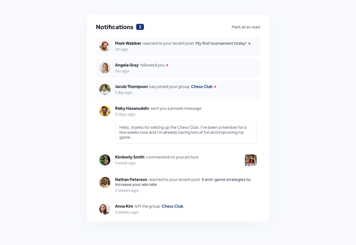
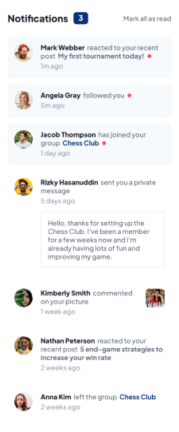

# Frontend Mentor - Notifications page solution

This is Max Ruuen's solution to the [Notifications page challenge on Frontend Mentor](https://www.frontendmentor.io/challenges/notifications-page-DqK5QAmKbC). Frontend Mentor challenges help you improve your coding skills by building realistic projects.

## Table of contents

- [Overview](#overview)
  - [The challenge](#the-challenge)
  - [Screenshot](#screenshot)
  - [Links](#links)
- [My process](#my-process)
  - [Built with](#built-with)
  - [What I learned](#what-i-learned)
- [Author](#author)

## Overview

### The challenge

Users should be able to:

- Distinguish between "unread" and "read" notifications
- Select "Mark all as read" to toggle the visual state of the unread notifications and set the number of unread messages to zero
- View the optimal layout for the interface depending on their device's screen size
- See hover and focus states for all interactive elements on the page

### Screenshot

#### Desktop Layout

#### Mobile Layout

### Links

- Solution URL: [Frontendmentor](https://www.frontendmentor.io/solutions/notifications-page-with-react-and-scss-vFi2BJu_-c)
- Live Site URL: [Cloudflare Pages](https://mbr-challenge-notification-page.pages.dev/)

## My process

### Built with

- React
- Luxon (JS date library)
- SCSS
- CSS Grid & Flex

### What I learned

The timestamp helper function which takes an ISO datetime string & returns a plaintext time string was cool to build and turned out really nice.

After a while of thinking about how to handle the different notification styling and markup requirements, I decided on different components for the notification types.

This could have probably been improved with the build of a generic notification item component which has logic inside to use the type & determine what elements to show / hide. I don't think the separate component solution came out too bad, especially if you needed to design future components where the state is different without everything falling over.

## Author

- Frontend Mentor - [@ruuen](https://www.frontendmentor.io/profile/ruuen)
- Twitter - [@maxruuen](https://www.twitter.com/maxruuen)
